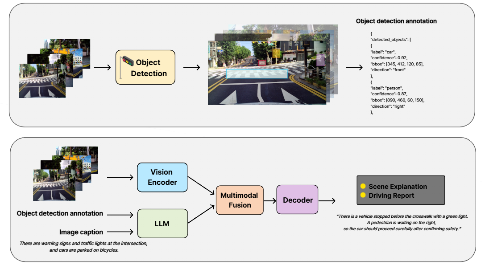
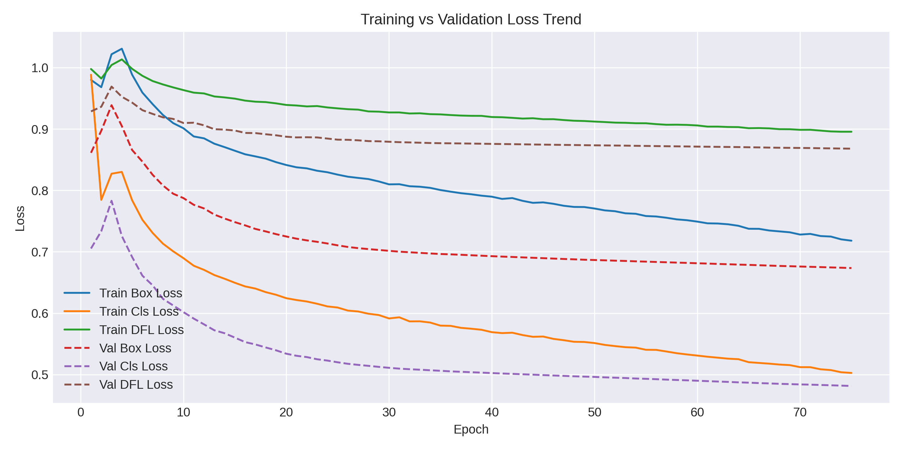
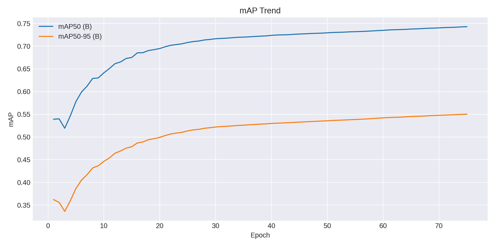
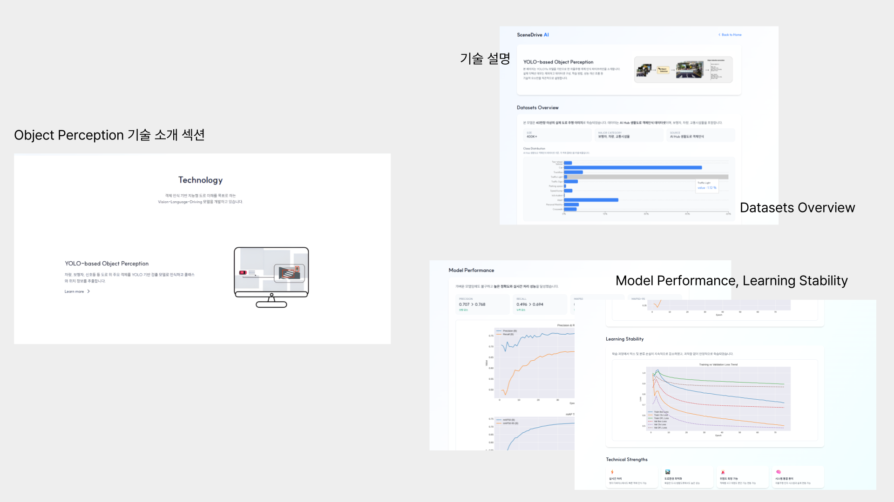
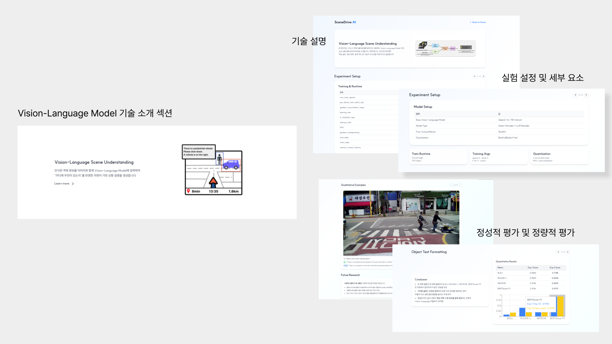
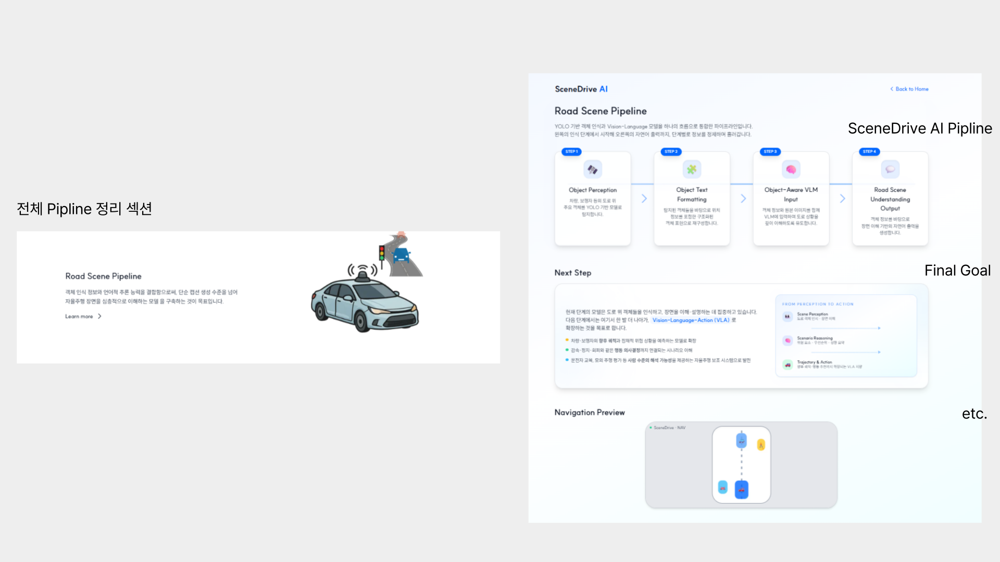
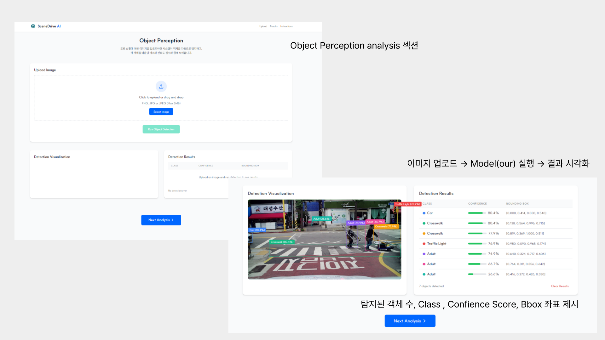
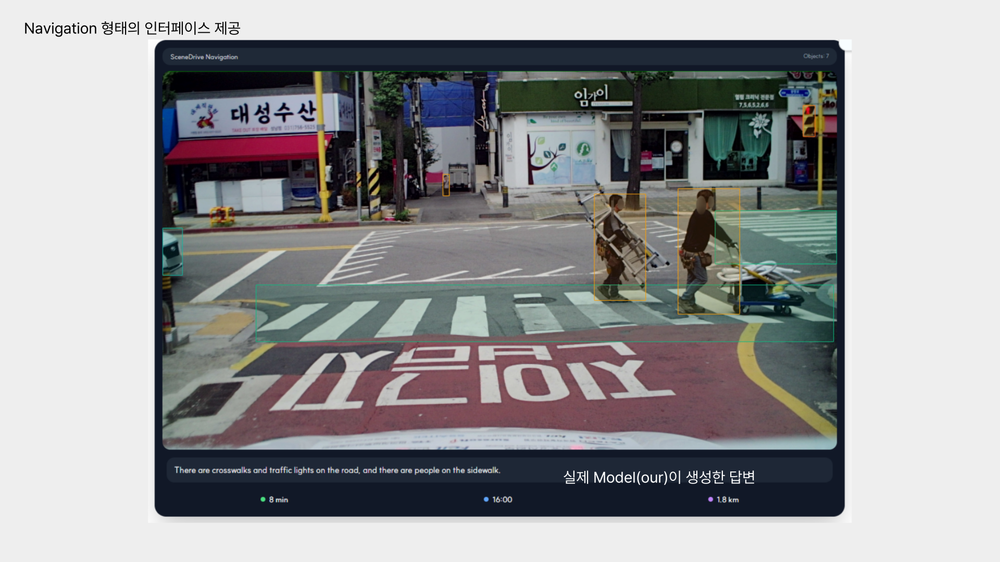

# SceneDrive AI

```
이 리포지토리는 Object-aware Road Scene Understanding를 목표로 하는 도로 상황 인지 시스템 구축 workspace 입니다.
```

## Datasets

The datasets used or referred to in this project are listed below

| Name | Link |
|------|------|
| 생활도로 객체인식 자율주행 데이터 | [AI Hub](https://www.aihub.or.kr/aihubdata/data/view.do?srchOptnCnd=OPTNCND001&currMenu=115&topMenu=100&searchKeyword=%EC%A3%BC%ED%96%89&aihubDataSe=data&dataSetSn=71784) |

## Main Datasets Structure

```
datasets/
├── vqa/
│   ├── caption_images
│   ├── captions
│
├── object_detection/
│   ├── images
│   ├── labels
├── train_txt
├── val_txt
├── data.yaml

```
---

## Development Environment

### Backend 
- Framework: **FastAPI, Uvicorn**
- Deep Learning: **PyTorch**, **Transformers**
  
### Frontend
- Framework: **React, Vite**
- Styling: **Tailwind CSS**

### Model 
- Object Detection: **YOLOv11s** 
- Vision-Language: **Qwen2-VL-7B-Instruct** 
  
---

## Key Features

#### Object Detection
   - YOLO 기반으로 차량, 보행자, 표지판 등 **도로 위 주요 객체 탐지**
   - 업로드된 이미지에 대해 bounding box 및 클래스 표시

#### Object-aware 입력 포맷팅
   - 탐지된 객체 정보를 정리하여 객체 종류, 위치, 객체 간 관계를 포함한 **구조화된 텍스트**로 변환

#### Vision-Language 기반 도로 상황 설명
   - 도로 이미지와 객체 정보를 함께 입력
   - **도로 상황 요약, 위험 요소, 주의사항** 등을 자연어로 생성

#### 웹 기반 데모 인터페이스
   - 이미지 업로드 후 도로 위 객체 탐지와 도로 장면 설명 결과 확인

---

## Model Experiments & Results

<p align="center">
  
</p>

### 1. Object Detection

#### 1-1. Loss Trends

| Metric        | Initial | Final |
|--------------|---------|-------|
| train/box_loss | 0.98  | 0.70  |
| train/cls_loss | 0.99  | 0.50  |
| train/dfl_loss | 1.00  | 0.89  |
| val/box_loss   | 0.86  | 0.65  |
| val/cls_loss   | 0.70  | 0.48  |
| val/dfl_loss   | 0.93  | 0.86  |

#### 1-2. Detection Metrics

| Metric        | Initial | Final | Improvement |
|--------------|---------|-------|------------|
| mAP50 (B)    | 0.54    | 0.743 | +37%       |
| mAP50-95 (B) | 0.36    | 0.55  | +19%       |
| Precision    | 0.707   | 0.768 | +6%        |
| Recall       | 0.496   | 0.694 | +20%       |

<p align="center">
  
  
  
</p>

---

### 2. Vision-Language Model

#### 2-1. Training Runtime Analysis

| Item                    | Value                         |
|-------------------------|-------------------------------|
| Total training time | 10,565s ≈ **2h 56m** |
| Total steps             | 519 steps                     |
| Avg. time per step      | **≈ 20.4s/step**              |


#### 2-2. VLM Performance

| Metric       | Score   |
|--------------|---------|
| BLEU         | 0.1748  |
| ROUGE-L      | 0.4036  |
| METEOR       | 0.4292  |
| BERTScore-F1 | 0.9179  |

---
## Demo 

### Home 
<p align="center">
  
</p>

### Technology Section
<p align="center">
  
  
  
</p>


### Analysis Section
<p align="center">
  
  
  
</p>

[▶ Watch the demo video](https://github.com/xnoeyes/2025_PBL_SceneDrive/releases/download/v1.0.0/demo.mp4)

---

## My Contributions

- **System Design**
  - 전체 파이프라인 설계

- **Object Detection Training**
  - 생활도로 객체인식 데이터셋 기반 YOLOv11s 학습 진행

- **VLM Fine-tuning & Evaluation**
  - Qwen2-VL-7B-Instruct 4bit 기반 VLM 학습 진행

- **Web Demo Implementation**
  - 데모 UI 구현 및 Backend 구축
    
---

## Limitations & Future Work

- 실제 자율주행 로그 시나리오(연속 프레임, 비/야간 환경)에 대한 추가 평가 필요
- 영상 단위 입력 및 temporal reasoning 확장
- LiDAR, HD Map 등 멀티모달 센서 정보와의 통합

